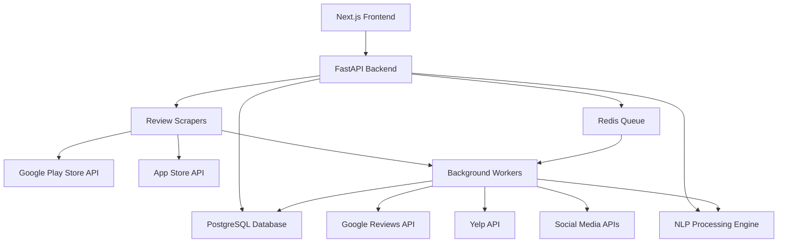

# Design Document

## Overview

The Review Gap Analyzer is a full-stack web application that processes app store reviews to identify user pain points and product opportunities. The system consists of a FastAPI backend for data processing and API services, and a Next.js frontend for user interaction and visualization.

The architecture follows a microservices approach with clear separation between data collection, processing, and presentation layers. The system uses asynchronous processing for time-intensive operations like review scraping and NLP analysis to maintain responsive user experience.

## Architecture

### High-Level Architecture



### System Components

1. **Frontend Layer (Next.js)**
   - User interface for input and results display
   - Real-time updates via WebSocket or polling
   - Chart visualization and data export

2. **API Layer (FastAPI)**
   - RESTful endpoints for frontend communication
   - Authentication and rate limiting
   - Request validation and response formatting

3. **Data Collection Layer**
   - App store scrapers with rate limiting
   - Website review aggregation from multiple platforms
   - URL parsing and app ID extraction
   - Review data normalization across all sources

4. **Processing Layer**
   - NLP pipeline for text analysis
   - Clustering algorithms for complaint categorization
   - Ranking and scoring algorithms

5. **Data Layer**
   - PostgreSQL for structured data storage
   - Redis for caching and job queuing

## Components and Interfaces

### Backend Components

#### 1. API Router (`/api/v1/`)
- `POST /analyze` - Submit app for analysis
- `GET /analysis/{analysis_id}` - Get analysis results
- `GET /analysis/{analysis_id}/status` - Check processing status
- `GET /analysis/{analysis_id}/export` - Export results (CSV/JSON)

#### 2. URL Parser Service
```python
class URLParser:
    def extract_app_id(self, url_or_id: str) -> AppIdentifier:
        # Handles both direct app IDs and store URLs
        # Returns standardized app identifier with platform info
```

#### 3. Review Scraper Service
```python
class ReviewScraperService:
    async def scrape_google_play(self, app_id: str) -> List[Review]
    async def scrape_app_store(self, app_id: str) -> List[Review]
    # Implements rate limiting and pagination

class WebsiteReviewAggregator:
    async def aggregate_website_reviews(self, website_url: str) -> List[Review]
    async def scrape_google_reviews(self, business_name: str) -> List[Review]
    async def scrape_yelp_reviews(self, business_name: str) -> List[Review]
    async def scrape_social_media_mentions(self, business_name: str) -> List[Review]
    # Implements cross-platform review collection and normalization
```

#### 4. NLP Processing Engine
```python
class NLPProcessor:
    def clean_text(self, reviews: List[Review]) -> List[Review]
    def filter_negative_reviews(self, reviews: List[Review]) -> List[Review]
    def cluster_complaints(self, reviews: List[Review]) -> List[ComplaintCluster]
    def generate_cluster_names(self, clusters: List[ComplaintCluster]) -> List[ComplaintCluster]
```

#### 5. Insights Generator
```python
class InsightsGenerator:
    def rank_clusters(self, clusters: List[ComplaintCluster]) -> List[RankedCluster]
    def calculate_trends(self, clusters: List[ComplaintCluster]) -> TrendData
    def generate_summary_stats(self, reviews: List[Review]) -> SummaryStats
```

### Frontend Components

#### 1. Analysis Input Form
- URL/App ID input with validation
- Platform selection (auto-detected from URL)
- Submit button with loading states

#### 2. Results Dashboard
- Summary statistics display
- Complaint clusters list/grid view
- Time trend charts
- Export functionality

#### 3. Cluster Detail View
- Expanded cluster information
- Sample review quotes
- Frequency and recency metrics

## Data Models

### Core Models

```python
class Review(BaseModel):
    id: str
    app_id: Optional[str]  # For app reviews
    website_url: Optional[str]  # For website reviews
    platform: Platform  # GOOGLE_PLAY | APP_STORE | GOOGLE_REVIEWS | YELP | FACEBOOK | TWITTER
    source_platform: str  # Original platform name for website reviews
    rating: Optional[int]  # Some platforms may not have ratings
    text: str
    date: datetime
    locale: str
    processed: bool = False

class ComplaintCluster(BaseModel):
    id: str
    analysis_id: str
    name: str
    description: str
    review_count: int
    percentage: float
    recency_score: float
    sample_reviews: List[str]
    keywords: List[str]

class Analysis(BaseModel):
    id: str
    app_id: Optional[str]  # For app analysis
    website_url: Optional[str]  # For website analysis
    analysis_type: str  # APP | WEBSITE
    platform: Optional[Platform]  # For app analysis
    status: AnalysisStatus  # PENDING | PROCESSING | COMPLETED | FAILED
    total_reviews: int
    negative_reviews: int
    clusters: List[ComplaintCluster]
    created_at: datetime
    completed_at: Optional[datetime]

class AppIdentifier(BaseModel):
    app_id: str
    platform: Platform
    app_name: Optional[str]
    developer: Optional[str]
```

### Database Schema

```sql
-- Reviews table
CREATE TABLE reviews (
    id VARCHAR PRIMARY KEY,
    app_id VARCHAR NOT NULL,
    platform VARCHAR NOT NULL,
    rating INTEGER NOT NULL,
    text TEXT NOT NULL,
    review_date TIMESTAMP NOT NULL,
    locale VARCHAR,
    processed BOOLEAN DEFAULT FALSE,
    created_at TIMESTAMP DEFAULT NOW()
);

-- Analysis table
CREATE TABLE analyses (
    id UUID PRIMARY KEY DEFAULT gen_random_uuid(),
    app_id VARCHAR NOT NULL,
    platform VARCHAR NOT NULL,
    status VARCHAR NOT NULL,
    total_reviews INTEGER,
    negative_reviews INTEGER,
    created_at TIMESTAMP DEFAULT NOW(),
    completed_at TIMESTAMP
);

-- Complaint clusters table
CREATE TABLE complaint_clusters (
    id UUID PRIMARY KEY DEFAULT gen_random_uuid(),
    analysis_id UUID REFERENCES analyses(id),
    name VARCHAR NOT NULL,
    description TEXT,
    review_count INTEGER NOT NULL,
    percentage DECIMAL(5,2) NOT NULL,
    recency_score DECIMAL(5,2) NOT NULL,
    sample_reviews JSONB,
    keywords JSONB
);
```

## Error Handling

### API Error Responses
- **400 Bad Request**: Invalid app ID/URL format
- **404 Not Found**: App not found in store
- **429 Too Many Requests**: Rate limit exceeded
- **500 Internal Server Error**: Processing failures

### Error Recovery Strategies
1. **Scraping Failures**: Retry with exponential backoff, fallback to cached data
2. **NLP Processing Errors**: Log errors, return partial results with warnings
3. **Database Connection Issues**: Connection pooling with automatic retry
4. **Rate Limiting**: Queue requests and process when limits reset

### User-Facing Error Messages
```python
ERROR_MESSAGES = {
    "INVALID_URL": "Please enter a valid Google Play or App Store URL or app ID",
    "APP_NOT_FOUND": "App not found. Please check the URL or app ID",
    "INSUFFICIENT_REVIEWS": "Not enough negative reviews found for meaningful analysis",
    "PROCESSING_FAILED": "Analysis failed. Please try again or contact support"
}
```

## Testing Strategy

### Unit Testing
- **Backend**: FastAPI endpoints, NLP functions, data models
- **Frontend**: React components, utility functions, API integration
- **Coverage Target**: 80% minimum

### Integration Testing
- **API Integration**: End-to-end API workflow testing
- **Database Integration**: Data persistence and retrieval
- **External Services**: Mock app store APIs for consistent testing

### Performance Testing
- **Load Testing**: Concurrent analysis requests
- **Scraping Performance**: Large app review datasets
- **NLP Processing**: Clustering algorithm performance with various dataset sizes

### Test Data Strategy
```python
# Mock review data for testing
SAMPLE_REVIEWS = [
    {"rating": 1, "text": "App crashes constantly on Android 14", "date": "2024-01-15"},
    {"rating": 2, "text": "Battery drain is terrible, phone dies in 2 hours", "date": "2024-01-10"},
    {"rating": 1, "text": "Needs offline mode, can't use without internet", "date": "2024-01-05"}
]
```

### Automated Testing Pipeline
1. **Pre-commit Hooks**: Code formatting, linting, basic tests
2. **CI/CD Pipeline**: Full test suite on pull requests
3. **Staging Environment**: Integration testing with real (limited) data
4. **Production Monitoring**: Error tracking and performance metrics

## Technical Implementation Details

### NLP Processing Pipeline
1. **Text Preprocessing**: Remove stopwords, normalize text, handle emojis
2. **Sentiment Filtering**: Use pre-trained models to identify negative sentiment
3. **Embedding Generation**: Use sentence transformers for semantic similarity
4. **Clustering**: Apply HDBSCAN or K-means clustering on embeddings
5. **Cluster Naming**: Use keyword extraction and LLM-based naming

### Asynchronous Processing
- **Celery/RQ**: Background job processing for scraping and NLP
- **WebSocket/SSE**: Real-time status updates to frontend
- **Progress Tracking**: Granular progress reporting for long-running tasks

### Caching Strategy
- **Redis**: Cache frequently accessed app data and analysis results
- **CDN**: Static assets and chart images
- **Database Query Optimization**: Proper indexing and query optimization

### Security Considerations
- **Rate Limiting**: Prevent abuse of scraping endpoints
- **Input Validation**: Sanitize all user inputs
- **CORS Configuration**: Proper cross-origin resource sharing setup
- **API Authentication**: Optional user accounts for usage tracking